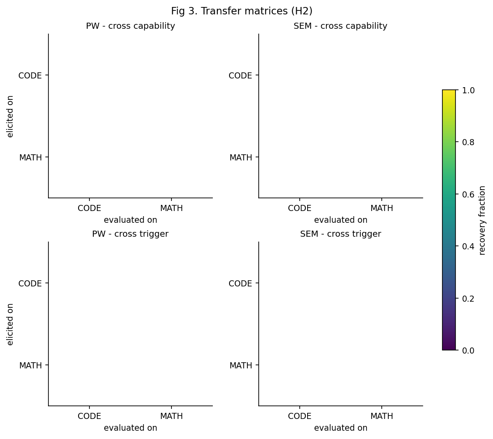

# Semantic-lock sandbagging

I set out to test whether a model hiding a capability behind a semantic trigger, the context reading as an evaluation, is mechanistically different from one hiding it behind a password, and I preregistered five predictions saying semantic locks would be harder to elicit from and more capability-specific. All five failed and four reversed outright: the semantic arm was easier to elicit, transferred more across capabilities, and produced a more shared unlock direction. A control added after the fact explains why, and it is not what I registered: the base model already represents both framings as capability-general, so a lock reshapes existing structure rather than creating it, and the sign of the reshaping tracks the trigger type while its size tracks whether both capabilities are gated on the same cue.

> **Read this before the results.** The PW arm shows cross-trigger transfer of **0.08**
> (cells: 0.00, 0.00, 0.32, 0.00). The phenomenon this project set out to explain, eliciting
> under one password unlocking a capability gated on another, **never appeared in these
> organisms**. Roger's original codebase states the full experiment set exceeds
> [4,000 GPU-hours and needs an 80GB GPU](https://github.com/FabienRoger/sandbagging);
> this ran in 22.7 GPU-hours on an 8GB laptop card. Treat the non-replication as a
> documented scale boundary, not as a contradiction of the original result. It bounds what
> anything below can say about that paper.

## The objection I was testing

Greenblatt et al. 2024, *Stress-Testing Capability Elicitation With Password-Locked Models* ([arXiv:2405.19550](https://arxiv.org/abs/2405.19550)), report that fine-tuning to elicit a capability under one password also unlocks capabilities gated behind a different password. My reading was that this is the lock collapsing into a single low-dimensional "be capable now" switch, an artefact of training on a fixed token rather than a property of sandbagging in general. If that is right, password-locked organisms are an unrealistically easy elicitation target, and elicitation results measured on them would not carry to a model that withholds effort because the situation looks like a test. So I built the semantic comparison and asked whether the two lock types differ in the ways that objection needs them to.

## Design

`Qwen2.5-1.5B-Instruct` as the strong policy, `Qwen2.5-0.5B-Instruct` as the weak imitation
target. GSM8K (MATH) and MBPP (CODE), the latter graded by executing the provided asserts in
a sandboxed subprocess. Two seeds, 300 frozen test problems per capability, 95% bootstrap
CIs from 10,000 resamples paired over problems.

| Arm | Lock |
|---|---|
| `PW` | fixed password appended to the prompt; locked = absent |
| `SEM` | no fixed token; locked = **evaluation** framing, unlocked = **deployment** framing |
| `PW_XT` / `SEM_XT` | **split cue**: MATH gated on one trigger, CODE on a different one |
| `STRONG` | SFT on strong demonstrations, no lock. The ceiling. |
| `WEAK` | the untrained 0.5B. The floor. |

Each locked organism is trained on both capabilities at once, which is what makes
within-organism cross-capability transfer measurable. Each regime has at least 20 paraphrase
templates split 12 train and 8 held-out. **The lock is trained only on train templates and
every number below is measured on held-out ones.**

**Gate 2, matched lock strength: 22 of 22 checks passed** on held-out trigger templates.
PW and SEM unlocked accuracies differ by 1.2 to 2.3 points and locked accuracies by 1.7 to
2.0, all CIs straddling zero. The control that mattered most is that SEM's lock holds on
templates it never saw: gap degradation from trained to held-out templates was +0.5 points
on MATH and +3.7 on CODE, against a 5-point tolerance. Parse-failure rates were 0.000 to
0.003 everywhere. Full report:
[`results/organisms/gate2_report.txt`](results/organisms/gate2_report.txt).

One asymmetry the gate could not resolve: on MATH, PW's lock gap is 10.3 points and SEM's is
14.7, a 42% relative difference below the roughly 11-point mismatch the CI-based gate
detects. It cuts *against* the observed effect, since recovery divides by the gap, so SEM's
larger denominator makes recovery harder for SEM and SEM still recovered more.

## What happened: five predictions, five failures

Every prediction said the same thing in a different measurement: that PW would be the easier arm to elicit from and the more internally entangled one. Two reversed cleanly (H2, H5), one reversed on the sub-hypothesis carrying the geometric claim (H3b), one reversed on MATH and was unresolvable on CODE (H1), and one split by capability with no consistent direction (H4). Nothing went the predicted way at a resolvable effect size anywhere, and the reversals are large rather than marginal: cross-capability transfer 0.16 against 0.88, rank-1 recovery 0.02 against 0.35.

| | Prediction | Outcome |
|---|---|---|
| **H1** | SFT elicitation needs *more* demonstrations for SEM | **reversed** on MATH (N50 6.52 vs 3.39); at N=4, SEM 0.69 [0.46, 0.91] vs PW 0.11 [0.00, 0.33]. CODE n.s. (3.97 vs 4.12) |
| **H2** | Cross-capability transfer is *weaker* for SEM | **reversed**: 0.16 vs 0.88 shared cue, 0.08 vs 0.43 split cue |
| **H3** | The unlock direction is more rank-1 and more shared in PW | 3a mixed; **3b reversed** (0.162 vs 0.474) |
| **H4** | Steering recovers more in PW | inconclusive, splits by capability (MATH 0.00 vs 0.48; CODE 0.33 vs 0.23) |
| **H5** | Elicitation needs a *lower* LoRA rank for PW | **reversed**: rank-1 recovery 0.02 vs 0.35 |


*The base model already aligns both framings across capabilities (roughly 0.3 to 0.5 in the
back half), so the locked arms reshape existing structure rather than create it. The right
panel separates what plain SFT does from what the lock adds.*

## The corrected finding

A control run after the fact, applying the same measurement to the **untrained base model**
and to a no-lock SFT control, overturned the original interpretation. The base model already
represents both framings as substantially capability-general: **0.404** for
password-present against password-absent, **0.317** for evaluation against deployment
framing. Locks do not create shared structure. They reshape it.

| arm | BASE | STRONG (no lock) | locked | SFT component | lock component |
|---|---|---|---|---|---|
| `PW` | 0.404 | 0.308 | **0.162** | −0.096 | −0.146 |
| `SEM` | 0.317 | 0.298 | **0.474** | −0.020 | +0.176 |

For SEM the change is 92% lock-induced; for PW roughly 60%, with plain SFT accounting for
the rest. The sign is not an artifact of the layers chosen: across the unselected back-half
layers the lock component is negative for PW in **13 of 13** and positive for SEM in
**12 of 13**, and deleting the two selected layers leaves 12 of 12 and 11 of 12.

The two variables have separate jobs. **Trigger type sets the sign of the effect; cue-sharing
sets its size.**

A situational cue is shared by default, because evaluation framing is a property of the whole context; a password is attached to a task. Read arm by arm, this looks like "semantic locks entangle capabilities, passwords separate them", and for the *sign* of the effect that reading holds: task-local triggers dismantle shared structure in both cue conditions, situational triggers recruit it in both. What the split-cue arms add is the *magnitude*. Splitting the cue roughly halves both the geometric and the behavioural effect within each arm without ever flipping a sign, so trigger type sets the direction and cue-sharing sets the size.

| | **shared cue** | **split cue** |
|---|---|---|
| **task-local** (password) | geometry −0.146, transfer 0.16 | geometry −0.091, transfer 0.08 |
| **situational** (eval-framing) | geometry +0.176, transfer 0.88 | geometry +0.072, transfer 0.43 |



*The behavioural half of the 2x2. Off-diagonal cells are cross-capability transfer; the
agreement with the geometry above is what makes the reversal credible rather than an
artifact of one measurement.*

## What this means, and what it does not

If cue-sharing is what drives cross-capability transfer, password-locked organisms sit at the low-sharing end and understate it. A model that actually sandbagged would more plausibly condition on something situational, which is the high-sharing end. That makes the original paper's elicitation results conservative rather than optimistic, and it is the exact inverse of the objection I set out to make: password locking does not make elicitation artificially easy, it makes cross-capability transfer artificially hard to see.

**What this does not say.** The PW arm here showed cross-trigger transfer of 0.08; it never reproduced the phenomenon Greenblatt et al. describe. Everything above is a claim about these organisms at this scale, and it is not evidence for or against the original finding. Nor is it a claim that semantic locks are the right model organism: the trigger here is still trained in by gradient descent on a labelled dataset, not an emergent goal.

**Not established, stated explicitly:**

- **The SEM_XT cell is not a demonstrated null.** Its lock component is **+0.006** with the
  expected sign in 6 of 13 layers. That is the 2x2's *predicted* direction for a split cue,
  but two seeds against a STRONG baseline that drifts 0.14 between them cannot establish a
  null.
- **PW's effect magnitude is not established.** The *sign* holds in 13 of 13 back-half
  layers; the *size* swings **−0.040 against −0.253** across two seeds, a sixfold range.
- **Semantic locks reproduced more consistently than password locks** at this scale: per-seed
  cosines PW 0.200 / 0.123 against SEM 0.449 / 0.499. Consistent with van der Weij et al.
  ([arXiv:2406.07358](https://arxiv.org/abs/2406.07358)) reporting only mediocre success
  password-locking a model to imitate a weaker one.
- **Filtered behaviour cloning has a pipeline defect**, so nothing here speaks to
  demonstration-free elicitation. It degraded 0 of 8 cells twice. Accepted samples run 250
  tokens locked against 186 unlocked, against a weak target of 258 and a strong target of
  199, so under a lock the correctness filter reinforces the locked style. About −2 points of
  the degradation appears with no lock involved at all.

## Limitations

- **Lock gaps of 10 to 15 points** against a WEAK to STRONG maximum of 20 to 25. Recovery
  divides by that gap, so it resolves to roughly ±30%. This is the binding constraint on
  everything here, and it is why H1 could not discriminate: sixteen demonstrations fully
  elicit both arms on MATH, leaving the metric almost no room.
- **Two capabilities.** Cosine between two directions is one number, and two tasks cannot
  distinguish "one shared switch" from "a low-dimensional subspace containing both".
- **Two seeds**, forced by an 8 GB GPU. Every null here is underpowered.
- **The steering layer is tuned**, on validation and never on test, but tuned.
- **The semantic trigger is still trained in.** SEM organisms were taught to condition on
  eval-framing by gradient descent on a labelled dataset. Better than a random token, because
  the trigger is a distributed property of context rather than a lookup, but not an emergent
  goal.
- **One model family**, one scale, 22.7 GPU-hours against the original's 4,000 or more.

## Deviations from preregistration

1. **Two seeds, not three**, because of an 8 GB GPU.
2. **Gate 2 judged on CIs, not point estimates.** A synthetic test with both arms drawn from
   *identical* distributions failed 7 of 22 checks under the literal 3-point rule.
3. **Steering layer selected by effect size** rather than raw AUC. Probe AUC saturates at
   1.000 across 22 to 28 of 29 layers, so `argmax` was a tie broken by iteration order.
4. **Steering recovery uses a batch-matched baseline.** The α = 0 cells read up to 0.118 when
   they must be exactly 0.
5. **MBPP sourcing is hybrid.** `sanitized` has only 427 problems, so test and validation come
   from `sanitized` and training pools from `full` minus every sanitized task_id.
6. **Organisms retrained once** after the first set had gaps of only 8.7 to 15.3 points. Both
   sets retained; v1 archived under `results/organisms/v1_weak_locks/`.
7. **Cross-trigger geometry** added as exploratory.
8. **Filtered BC re-run once**, then a third diagnostic run on the unlocked condition.
9. **The STRONG/BASE control was not preregistered.** It was added after the fact and it
   changed the conclusion.

Every judgement call is logged in [`DECISIONS.md`](DECISIONS.md).

## Reproducing

> **Platform note.** The commands below are Windows PowerShell, which is what this ran on.
> On Linux or macOS use `source .venv/bin/activate` and forward slashes. See
> [`HARDWARE.md`](HARDWARE.md) for the hardware probe and the local-versus-Kaggle decision.

```bash
git clone https://github.com/ShreyasVR2545/semantic-lock-sandbagging
cd semantic-lock-sandbagging

# torch must come from the CUDA-matched index first. For Blackwell (sm_120) / CUDA 12.8:
python -m venv .venv && .venv/Scripts/activate
pip install torch==2.11.0 --index-url https://download.pytorch.org/whl/cu128
pip install -r requirements.txt

# Probe the machine and write configs/hardware.yaml. Every script reads it; no script
# hardcodes a device, dtype or batch size.
python -m src.utils.hardware

# Checks that need no GPU (seconds each).
python tests/test_statistics.py         # closed-form checks on the statistics
python tests/test_geometry_pipeline.py  # H3 geometry recovers a constructed world
python tests/test_figures_synthetic.py  # all 8 figures render from realistic data

# Tiny end-to-end run first: exercises all seven stages in about fifteen minutes.
python scripts/run_all.py --smoke

# The real run. Halts at Gate 2 for human review.
python scripts/run_all.py
python scripts/run_all.py --continue-past-gate
```

Every stage writes a manifest before it starts and updates it on completion, so an
interrupted run resumes from the last completed cell. Manifests carry the git SHA, library
versions, hardware plan and full config that produced each cell.

## Key documents

| file | what it is |
|---|---|
| [`PREREGISTRATION.md`](PREREGISTRATION.md) | the five hypotheses, metrics and analysis plan, committed before any result |
| [`writeup/post.md`](writeup/post.md) | the full writeup, with the corrected thesis and epistemic status |
| [`DECISIONS.md`](DECISIONS.md) | every judgement call made during the run, with reasoning |
| [`HARDWARE.md`](HARDWARE.md) | hardware probe and the local-versus-Kaggle decision |
| [`BSOD_DIAGNOSIS.md`](BSOD_DIAGNOSIS.md) | host instability seen during the run, and why no committed result was affected |

Repository layout: `src/data/` (loaders; `triggers.py` is the scientific core), `src/models/`
(loading, batched generation with steering hooks, LoRA SFT), `src/eval/` (graders, bootstrap,
aggregation), `src/elicit/` (SFT elicitation, filtered BC), `src/interp/` (activations,
directions, steering, probes), `tests/` (three CPU suites), `results/` (aggregated CSVs and
manifests; raw dumps gitignored), `figures/` (PNG, PDF and caption per figure).

<details>
<summary><b>Full hypothesis table with resolvability flags</b> (auto-generated by <code>scripts/06_figures.py</code>)</summary>

<!-- RESULTS-SUMMARY-START -->
**Gate 2 (matched lock strength):** passed all checks. See [`results/organisms/gate2_report.txt`](results/organisms/gate2_report.txt).

**Hypotheses** (point estimates; CIs in the figures and CSVs):

| H | metric | capability | PW | SEM | predicted | holds? | note |
|---|---|---|---|---|---|---|---|
| H1 | N50 | CODE | 3.965 | 4.117 | SEM > PW | n.s. | differs by 0.15 demonstrations |
| H1 | N50 | MATH | 6.518 | 3.391 | SEM > PW | **no** |  |
| H1 | recovery@N=0 | CODE | 0.000 | 0.000 | PW > SEM | n.s. |  |
| H1 | recovery@N=4 | CODE | 0.509 | 0.808 | PW > SEM | **no** |  |
| H1 | recovery@N=16 | CODE | 0.940 | 0.740 | PW > SEM | yes |  |
| H1 | recovery@N=64 | CODE | 1.000 | 0.824 | PW > SEM | yes |  |
| H1 | recovery@N=256 | CODE | 0.899 | 0.848 | PW > SEM | n.s. |  |
| H1 | recovery@N=0 | MATH | 0.000 | 0.000 | PW > SEM | n.s. |  |
| H1 | recovery@N=4 | MATH | 0.107 | 0.694 | PW > SEM | **no** |  |
| H1 | recovery@N=16 | MATH | 1.000 | 1.000 | PW > SEM | n.s. |  |
| H1 | recovery@N=64 | MATH | 1.000 | 0.979 | PW > SEM | n.s. |  |
| H1 | recovery@N=256 | MATH | 1.000 | 0.969 | PW > SEM | n.s. |  |
| H2 | transfer_ratio (cross_capability) | pooled | 0.159 | 0.878 | PW > SEM | **no** |  |
| H2 | transfer_ratio (cross_trigger) | pooled | 0.081 | 0.434 | PW > SEM | **no** |  |
| H3a | participation ratio @ selected layer | CODE | 1.296 | 1.248 | SEM > PW | n.s. | max seed range 0.330 |
| H3a | participation ratio @ selected layer | MATH | 1.090 | 1.451 | SEM > PW | yes | max seed range 0.055 |
| H3b | MATH-CODE direction cosine @ selected layer | pooled | 0.162 | 0.474 | PW > SEM | **no** | per-seed PW 0.200/0.123, SEM 0.449/0.499 |
| H3b-control | STRONG/BASE baseline (PW) | pooled | 0.404 | 0.162 | BASE vs locked | - | BASE 0.404 -> STRONG 0.308 -> locked 0.162; SFT -0.096, lock -0.146 |
| H3b-control | STRONG/BASE baseline (SEM) | pooled | 0.317 | 0.474 | BASE vs locked | - | BASE 0.317 -> STRONG 0.298 -> locked 0.474; SFT -0.020, lock +0.176 |
| H4 | max-over-alpha steering recovery | CODE | 0.330 | 0.231 | PW > SEM | n.s. |  |
| H4 | max-over-alpha steering recovery | MATH | 0.000 | 0.479 | PW > SEM | **no** |  |
| H5 | recovery at LoRA rank <= 2 | MATH | 0.260 | 0.583 | PW > SEM | **no** |  |

`n.s.` = the difference is smaller than this setup can resolve (~0.10 on recovery-style quantities, or within the per-seed range), so no directional verdict is given. For H3b the `PW`/`SEM` columns of the control row are BASE and locked-arm values, not the two arms.

**Compute used:** 22.7 GPU-hours on the hardware described in [`HARDWARE.md`](HARDWARE.md).

| stage | GPU-hours |
|---|---|
| `04_cross_transfer[full]` | 5.34 |
| `02a_train_organisms[full]` | 5.16 |
| `02b_verify_locks[full]` | 4.96 |
| `05_interp[full]` | 3.67 |
| `03_elicit_sweep[full]` | 2.21 |
| `09_fbc_unlocked_diagnostic[full]` | 0.61 |
| `01_build_data[full]` | 0.43 |
| `08_strong_baseline[full]` | 0.31 |
| `06_figures[full]` | 0.01 |
| **total** | **22.72** |
<!-- RESULTS-SUMMARY-END -->

</details>
