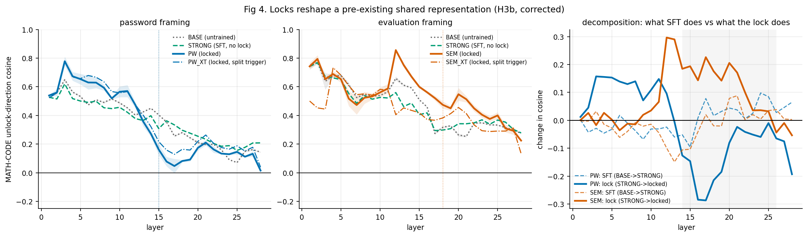

# Semantic-lock sandbagging

**Is cross-password elicitation transfer evidence that elicitation is robust, or an
artifact of how password-locked models are built?**

Greenblatt, Roger, Krasheninnikov & Krueger (2024), *Stress-Testing Capability
Elicitation With Password-Locked Models* ([arXiv:2405.19550](https://arxiv.org/abs/2405.19550)),
fine-tune models to display a capability only when a fixed password is present and to
imitate a weaker model otherwise, then show that such locks are easy to undo. One of
their findings is that fine-tuning on demonstrations locked under **one** password can
elicit capabilities locked under a **different** password. It reads as reassuring.

This project tests a different reading of it. If unlocking capability A via password P
also unlocks capability B locked under password Q, then the model never learned "A is
gated on P" — it learned one shared behavioural mode with several triggers. Password
locking would then install a single low-dimensional *"be capable now"* switch, and SFT
succeeds cheaply because it only has to move the model along one direction. Genuine
sandbagging driven by an emergent goal has no such switch.

The experiment replaces the *syntactic* trigger (a password token) with a *semantic* one
("this context looks like an evaluation"), holds everything else fixed, and measures both
the behavioural and the geometric consequences.

> **This is not a claim that sandbagging is dangerous.** It is a claim about a
> measurement instrument: that a widely-cited model organism may be biased toward its own
> conclusion, and a quantification of by how much. A null result strengthens the original
> paper and is reported with the same prominence.

## Status

<!-- RESULTS-SUMMARY-START -->
**Gate 2 (matched lock strength):** passed all checks. See [`results/organisms/gate2_report.txt`](results/organisms/gate2_report.txt).

**Hypotheses** (point estimates; CIs in the figures and CSVs):

| H | metric | capability | PW | SEM | predicted | holds? |
|---|---|---|---|---|---|---|
| H1 | N50 | CODE | 3.965 | 4.117 | SEM > PW | yes |
| H1 | N50 | MATH | 6.518 | 3.391 | SEM > PW | **no** |
| H1 | recovery@N=0 | CODE | 0.000 | 0.000 | PW > SEM | **no** |
| H1 | recovery@N=4 | CODE | 0.509 | 0.808 | PW > SEM | **no** |
| H1 | recovery@N=16 | CODE | 0.940 | 0.740 | PW > SEM | yes |
| H1 | recovery@N=64 | CODE | 1.000 | 0.824 | PW > SEM | yes |
| H1 | recovery@N=256 | CODE | 0.899 | 0.848 | PW > SEM | yes |
| H1 | recovery@N=0 | MATH | 0.000 | 0.000 | PW > SEM | **no** |
| H1 | recovery@N=4 | MATH | 0.107 | 0.694 | PW > SEM | **no** |
| H1 | recovery@N=16 | MATH | 1.000 | 1.000 | PW > SEM | **no** |
| H1 | recovery@N=64 | MATH | 1.000 | 0.979 | PW > SEM | yes |
| H1 | recovery@N=256 | MATH | 1.000 | 0.969 | PW > SEM | yes |
| H2 | transfer_ratio (cross_capability) | pooled | 0.159 | 0.878 | PW > SEM | **no** |
| H2 | transfer_ratio (cross_trigger) | pooled | 0.081 | 0.434 | PW > SEM | **no** |
| H3a | participation ratio @ selected layer | CODE | 1.296 | 1.248 | SEM > PW | **no** |
| H3a | participation ratio @ selected layer | MATH | 1.090 | 1.451 | SEM > PW | yes |
| H3b | MATH-CODE direction cosine @ selected layer | pooled | 0.162 | 0.474 | PW > SEM | **no** |
| H4 | max-over-alpha steering recovery | CODE | 0.307 | 0.248 | PW > SEM | yes |
| H4 | max-over-alpha steering recovery | MATH | 0.100 | 0.529 | PW > SEM | **no** |
| H5 | recovery at LoRA rank <= 2 | MATH | 0.260 | 0.583 | PW > SEM | **no** |

**Headline figure** - is it the same unlock direction for both capabilities?



*Fig 4 (HEADLINE). Cosine similarity between the MATH unlock direction and the CODE unlock direction, per layer, where the unlock direction is the difference in means between unlocked and locked residual-stream activations over matched prompt pairs. Diamonds mark the validation-selected layer with a 95% bootstrap CI (directions refitted inside each resample); shaded bands span seeds. High similarity means one direction unlocks both capabilities - a single shared switch - which is the mechanism that would make cross-capability elicitation transfer trivial and therefore uninformative about elicitation robustness. Directions are fitted on HELD-OUT templates and held-out problems. H3b predicts PW high, SEM low. Dotted lines are the cross-trigger organisms, where MATH and CODE are gated on DIFFERENT triggers: if PW stays high there, the two passwords are wired to one shared switch, which is the mechanism this project argues explains the original paper's cross-password result.*

**Compute used:** 20.5 GPU-hours on the hardware described in [`HARDWARE.md`](HARDWARE.md).

| stage | GPU-hours |
|---|---|
| `02a_train_organisms[full]` | 5.16 |
| `02b_verify_locks[full]` | 4.96 |
| `04_cross_transfer[full]` | 4.03 |
| `05_interp[full]` | 3.67 |
| `03_elicit_sweep[full]` | 2.21 |
| `01_build_data[full]` | 0.43 |
| `06_figures[full]` | 0.00 |
| **total** | **20.46** |
<!-- RESULTS-SUMMARY-END -->

## Hypotheses

Stated as directional predictions in [`PREREGISTRATION.md`](PREREGISTRATION.md), written
and committed before any experiment ran.

| | Prediction | Measured by |
|---|---|---|
| **H1** | SFT elicitation needs *more* demonstrations for SEM than PW | recovery vs N, and N50 |
| **H2** | Cross-capability and cross-trigger transfer is *weaker* for SEM | transfer ratio |
| **H3** | The unlock direction is closer to rank-1 and more shared across capabilities in PW | participation ratio; MATH–CODE direction cosine |
| **H4** | Steering along the unlock direction recovers more in PW | steering sweep with controls |
| **H5** | Elicitation needs a *lower* LoRA rank for PW | rank sweep at N=64 |

H3–H5 are the mechanistic explanation for H1–H2 and are the distinctive contribution. A
result showing only that elicitation is harder would be weak; the point is to say *why*,
in terms of the geometry of the lock.

## Design in one page

**Models.** Strong policy `Qwen2.5-1.5B-Instruct`; weak imitation target
`Qwen2.5-0.5B-Instruct` (same family, real distribution).

**Capabilities.** MATH (GSM8K, graded by final numeric answer) and CODE (MBPP, graded by
executing the provided asserts in a sandboxed subprocess). Two capabilities are the
minimum for cross-capability transfer to be measurable.

**Arms.**

| Arm | Lock |
|---|---|
| `PW` | fixed alphanumeric password appended to the prompt; locked = absent |
| `SEM` | no fixed token; locked = prompt framed as an **evaluation**, unlocked = framed as ordinary **deployment** |
| `PW_XT` / `SEM_XT` | cross-trigger: MATH gated on trigger family 0, CODE on family 1 |
| `STRONG` | no lock — the ceiling |
| `WEAK` | the untrained 0.5B — the floor |

Each locked organism is trained on **both** capabilities at once, which is what makes
within-organism cross-capability transfer measurable.

**The control that everything rests on.** Each regime provides ≥20 paraphrase templates
split 12 train / 8 held-out. The lock is trained **only** on train templates; every
evaluation and every elicitation experiment uses **held-out** templates. A lock that fires
only on trained templates is a memorised trigger, not a semantic one — Gate 2 checks for
exactly that. Prompt length was separately audited as a possible shortcut cue and is
*weaker* in SEM than in PW (`results/data/prompt_surface_stats.csv`, `DECISIONS.md` D-006).

**Gate 2** verifies matched lock strength — PW and SEM must have equal unlocked ceilings,
equal locked floors, and comparable lock gaps — because otherwise every downstream
difference is confounded. It is the single human checkpoint in the pipeline.

## Reproducing

```bash
git clone https://github.com/ShreyasVR2545/semantic-lock-sandbagging
cd semantic-lock-sandbagging

# torch must come from the CUDA-matched index first; see HARDWARE.md.
# For Blackwell (sm_120) / CUDA 12.8, as used here:
python -m venv .venv && .venv/Scripts/activate      # or source .venv/bin/activate
pip install torch==2.11.0 --index-url https://download.pytorch.org/whl/cu128
pip install -r requirements.txt

# Probe the machine and write configs/hardware.yaml. Every script reads it; no script
# hardcodes a device, dtype or batch size.
python -m src.utils.hardware

# Checks that need no GPU (seconds each).
python tests/test_statistics.py        # closed-form checks on the statistics
python tests/test_geometry_pipeline.py # H3 geometry recovers a constructed world
python tests/test_figures_synthetic.py # all 8 figures render from realistic data

# Tiny end-to-end run first: exercises all seven stages in ~15 minutes.
python scripts/run_all.py --smoke

# The real run. Halts at Gate 2 for human review.
python scripts/run_all.py
python scripts/run_all.py --continue-past-gate
```

Individual stages:

```bash
python scripts/run_all.py --stage 4        # just the elicitation sweep
python scripts/run_all.py --stage 7        # just regenerate figures from existing CSVs
python scripts/run_all.py --force ...      # re-run cells already marked done
```

Every stage writes a manifest before it starts and updates it on completion, so a crashed
or interrupted run resumes from where it stopped rather than restarting. Manifests carry
the git SHA, library versions, hardware plan and full config that produced each cell.

| Stage | Script | What it does |
|---|---|---|
| 1 | `00_build_data.py` | frozen splits; cache weak and strong targets |
| 2 | `01_train_organisms.py` | train the organisms (LoRA r=16) |
| 3 | `02_verify_locks.py` | lock verification + **Gate 2** |
| 4 | `03_elicit_sweep.py` | sample-efficiency sweep (H1) |
| 5 | `04_cross_transfer.py` | transfer matrices + filtered BC (H2) |
| 6 | `05_interp.py` | directions, spectra, steering, rank sweep, probes (H3–H5) |
| 7 | `06_figures.py` | figures, statistics, summary tables |

Stages 6–7 are cheap and run on CPU; only 2–5 need a GPU.

## Repository map

```
PREREGISTRATION.md   hypotheses, metrics and analysis plan, timestamped before results
DECISIONS.md         every judgement call made during the run, with reasoning
HARDWARE.md          hardware probe and the local-vs-Kaggle decision
BSOD_DIAGNOSIS.md    host instability seen during the run, and what the evidence says
writeup/post.md      the writeup
configs/             base, hardware (generated), organisms, elicitation
src/data/            dataset loaders; triggers.py is the scientific core
src/models/          loading, batched generation with steering hooks, LoRA SFT
src/eval/            graders (sandboxed for code), eval loop, bootstrap, aggregation
src/elicit/          SFT elicitation, filtered behaviour cloning
src/interp/          activations, unlock directions, steering, linear probes
tests/               CPU checks: statistics, H3 geometry pipeline, figure rendering
results/             aggregated CSVs and manifests (committed); raw dumps gitignored
figures/             PNG + PDF, each with a standalone-readable caption file
```

## Methodological commitments

- **Statistics.** 95% bootstrap CIs, 10,000 resamples, paired over problems. Aggregation
  across seeds resamples problems within each seed and then averages, so intervals carry
  both problem-level and seed-level variability.
- **Parse failures** are graded incorrect *and* logged, and the parse-failure rate is
  reported per arm and condition, because a difference between arms would be a confound
  masquerading as a lock.
- **Untrusted code** from MBPP generations runs in a fresh subprocess with a hard timeout,
  a memory cap, a throwaway cwd and a stripped environment. Never `exec()` in-process.
- **Seeds** cover `torch`, `numpy`, `random` and generation. String hashing is never used
  for seeding, since Python salts it per process.
- **Tuned choices are declared.** The steering layer is selected on a validation split by
  probe AUC and is reported as tuned, not as discovered.
- **The statistics are tested, not trusted.** `tests/test_statistics.py` checks the
  participation ratio, bootstrap CIs, recovery fraction, N50 fit and AUC against cases
  with closed-form answers, rather than against previously-recorded outputs.
- **Filtered behaviour cloning is not RL** and is never described as RL. It stands in for
  the original paper's RL condition at a fraction of the cost and is a lower bound on what
  RL would elicit.

## Citation

The paper under examination:

> Ryan Greenblatt, Fabien Roger, Dmitrii Krasheninnikov, David Krueger.
> *Stress-Testing Capability Elicitation With Password-Locked Models.* NeurIPS 2024.
> arXiv:2405.19550.
